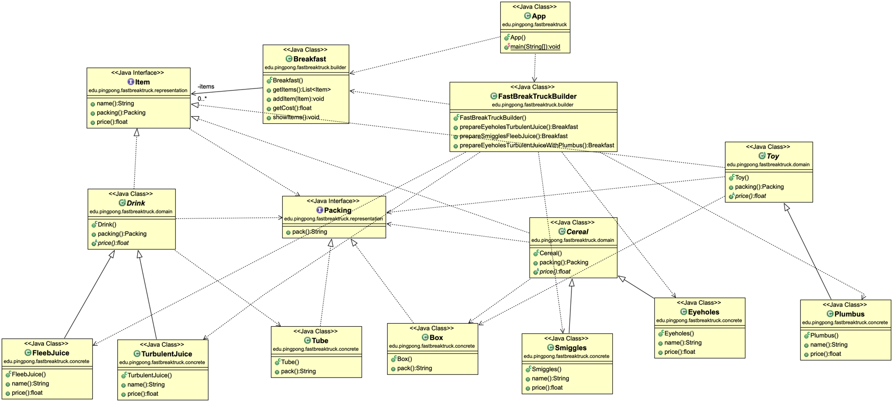

# FastBreakTruck

Exercise to put a design pattern into practice, in this case the "builder" pattern has been used, a project carried out by putting TDD, DDD, SOLID ... into practice.

### The problem:
The problem is presented in such a way that we need a small application in charge of generating different types of breakfast, the breakfasts are made up of different items, and each item has its own characteristics. 

So it is about "making an assembly line" of some already defined breakfasts, building complex objects from other simple objects.
The solution must follow the "SOLID" principles, because when wanting to add more items or generate new types of breakfasts (which are a set of items) it must be easy to do.

### Why Builder?
To begin with, the problem is based on the creation of objects, breakfasts in this case, so the most appropriate would be a design pattern of a creational type.

The "builder" pattern has been chosen since basically this allows us to build complex objects step by step, and in this case what we want to do, we need to create a breakfast (complex object) step by step (add items to it).

The pattern allows us to produce different types and representations of an object using the same building code.

### UML Diagram of the code:

